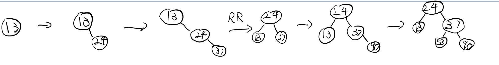
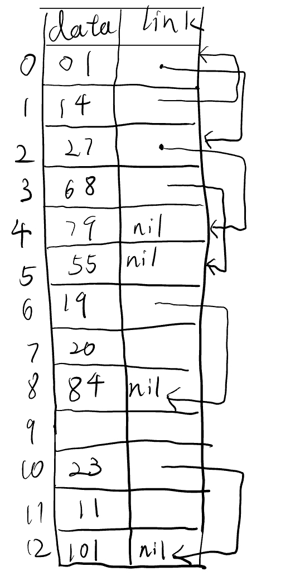
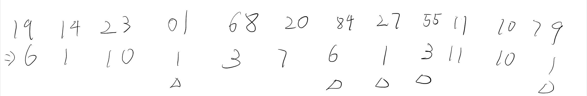
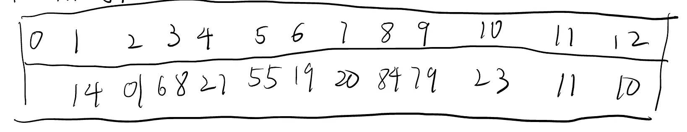

# 第十章作业

**姓名：王天一**

**学号：320200931301**

## 名词解释

### 检索

在给定数据结构中查找满足某种条件的数据元素的过程。

### AVL树

一种二叉树结构，它的子树的深度是平衡的。

### 散列表

用散列法组织存储的线性表。

### 碰撞

有两个不同的关键字映射到了同一地址空间，这种情况叫碰撞。

## 基于检索性质，检索可分为哪几类？并举例说明

1. 顺序检索，例如找一组数据中每个元素的位置。
2. 二分检索，例如查找书中的某一页码
3. 分块检索，例如查字典目录+字典正文

## 依据检索对象及其组织关系，检索方法主要分为哪几类？

1. 顺序表和线性表方法。
2. 直接访问法。
3. 树检索法。

## 依次输入13,24,37,90,53，请构造一颗AVL树（要求画出构造过程的主要步骤图示）

## 设散列空间为[0..12]，散列函数为H(k)=k MOD 13，给定的关键字序列为：19，14，23，01,68,20,84,27,55,11,10,79。试画出分别用拉链法和线性探测再散列解决冲突时所构造出的散列表。

### 拉链法

#### 外链法

#### 外链法

### 线性探测

元素存储位置为

所以散列表为

